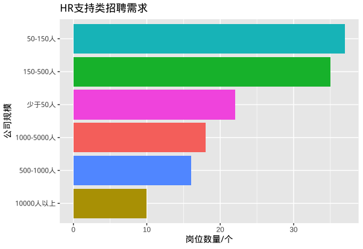

# 人力资源岗位招聘需求分析

## 总述

本次采集有效数据4111条，按高层（总监级），中层（经理或主管级或专业级），基层（支持类）三个层次分析HR岗位招聘需求，数据说明如下：

-   总监级：90条数据，11个维度；
-   经理\|主管级：2867条数据，11个维度；
-   专业级：712条数据，11个维度；
-   支持类：149条数据，11个维度；

本次将从如下方面分析招聘市场数据：

-   城市分布 ： 招聘岗位主要分布在江浙、广东、四川。
-   公司行业 ： 行业跨度大，但主要集中于制造业，如电子/集成电路、机械/重工。
-   公司规模 : 主要是500人以下公司规模招聘需求最活跃。
-   公司类型 ： 民营企业为最大雇主，占市场招聘需求的72%以上。
-   经验学历 ： 学历以本科为主，总监级别须平均7.5年相关经验，经理级别须平均5年相关经验。
-   任职要求 ： 主要围绕人力六大模块，管理级注重全盘经验，基层偏重招聘和行政。
-   薪酬水平 ： 按月薪，总监级平均2万元，经理级平均12500元，专员和助理类平均6000元。
-   福利待遇 ： 主要为五险一金、奖金补贴、培训、节日福利、假期等。
-   特别观察（广州）: 经理级及以上数据712条，经理级以下203条。平均月薪，经理级以上12000元、经理级以下6000元。

## 城市分布

## 公司行业

HR岗位招聘需求行业跨度很大，但主要需求还是集中在制造业，紧随其后的服务业主要集中在软件、电商、进出品贸易行业。其中，电子技术/半导体/集成电路、机械/设备/重工两个行业侧重综合管理和专业技能；快消品、建筑/建材/工程、计算机软件三个行业侧重综合管理；汽车、贸易/进出口、互联网/电商侧重专业技能；服装/纺织、保险行业侧重HR支持辅助作用。

## 公司规模

用工市场上500人以下企业招聘最为活跃，其中，HR总监招聘需求占66%，HR经理/主管招聘需求占65%；

## 公司类型

## 经验学历

## 任职要求

## 薪酬水平

## 福利待遇

## 特别观察(广州)

